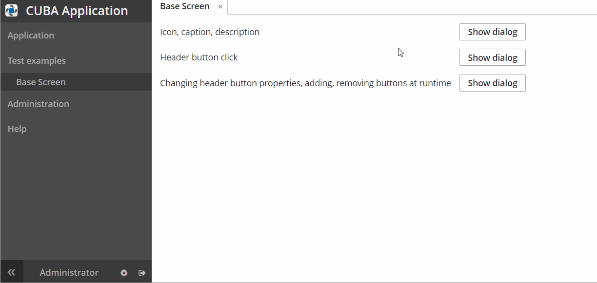

## HeaderButton add-on demo

This application demonstrates abilities of [HeaderButton add-on](https://github.com/Flaurite/headerbutton).

### How to launch

1. Download [HeaderButton add-on](https://github.com/Flaurite/headerbutton).
2. cd to the project dir and run the following commands:

    ```shell script
    ./gradlew assemble install
    ```

3. Download this demo and launch application using CUBA run configuration
   in the IDEA or using this commands:

   ```shell script
   ./gradlew assemble startDb createDb setupTomcat deploy start
   ```

### Samples

  


